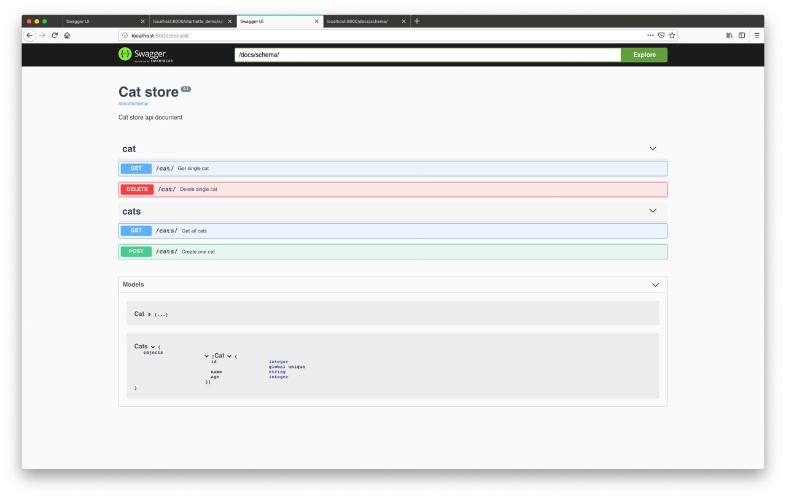

# Starchart

## API document support for Starlette project


## Features

* Inherit `starlette.schemas.BaseSchemaGenerator` 
* Support OpenAPI 2 and 3, define API schema by your way
* Provide configurable [SwaggerUI](http://swagger.io/swagger-ui/)
* ...

## Install

```shell
pip install -U starchart
```

## Tutorial

Let see a simple example app:
```python
"""OpenAPI2(Swagger) example
"""
from functools import partial

from starlette.applications import Starlette
from starlette.requests import Request
from starlette.responses import JSONResponse
from starlette.endpoints import HTTPEndpoint
from uvicorn import run

from starchart.generators import SchemaGenerator
from starchart.endpoints import SwaggerUI, RedocUI, Schema


app = Starlette(debug=True)

app.schema_generator = SchemaGenerator(
    title="Cat store",
    description="Cat store api document",
    version="0.1",
    openapi_version="2.0",
)
# define data
CATS = {
    1: {"id": 1, "name": "DangDang", "age": 2},
    2: {"id": 2, "name": "DingDing", "age": 1},
}
# add schema definition
app.schema_generator.add_schema(
    "Cat",
    {
        "properties": {
            "id": {"description": "global unique", "type": "integer"},
            "name": {"type": "string"},
            "age": {"type": "integer"},
        },
        "type": "object",
    },
)


# define routes and schema(in doc string)
@app.route("/cat/")
class Cat(HTTPEndpoint):
    def get(self, req: Request):
        """
        summary: Get single cat
        tags:
        - cat
        parameters:
        - name: id
          type: integer
          in: query
          required: True
        responses:
          "200":
            description: OK
            schema:
              $ref: '#/definitions/Cat'
          "404":
            description: Not found
       """
        return JSONResponse(CATS[1])

    def delete(self, req: Request):
        """
        summary: Delete single cat
        tags:
        - cat
        parameters:
        - name: id
          type: integer
          in: query
          required: True
        responses:
          "204":
            description: OK
            schema:
              $ref: '#/definitions/Cat'
          "404":
            description: Not found
        """
        cat = CATS.pop(1)
        return JSONResponse(cat)


# define doc by yaml or json file
@app.route("/cats/", methods=["GET"])
@app.schema_generator.schema_from("./examples/docs/cats_get.yml")
def list_cats(req: Request):
    return JSONResponse(list(CATS.values()))


@app.route("/cats/", methods=["POST"])
@app.schema_generator.schema_from("./examples/docs/cats_post.json")
async def list_cats(req: Request):
    cat = await req.json()
    CATS[cat["id"]] = cat
    return JSONResponse(cat)


# add document's endpoints
schema_path = "/docs/schema/"
app.add_route(
    "/docs/swagger/",
    SwaggerUI,
    methods=["GET"],
    name="SwaggerUI",
    include_in_schema=False,
)
app.add_route(
    "/docs/redoc/", RedocUI, methods=["GET"], name="SwaggerUI", include_in_schema=False
)
app.add_route(
    schema_path, Schema, methods=["GET"], name="SwaggerSchema", include_in_schema=False
)
# config endpoints
SwaggerUI.set_schema_url(schema_path)
RedocUI.set_schema_url(schema_path)
Schema.set_schema_loader(partial(app.schema_generator.get_schema, app.routes))

run(app)
```

Then we can get swagger UI:


## More examples

See **examples/**


## Details

### How can I define endpoints schema?

* Function or method's docstring
* From yaml or json file(by `schema_from`)
* ...

### How the swagger UI works?

We provide two endpoints: a standard web page (see *starchart/static/index.html*) and a 
standard schema api


## TODO

- [x] OpenAPI3 example app
- [X] Redoc UI support
- [X] Provide a Starlette extension, make it easier to integrate your projects
- [ ] Requset/Response validation by defined schema
